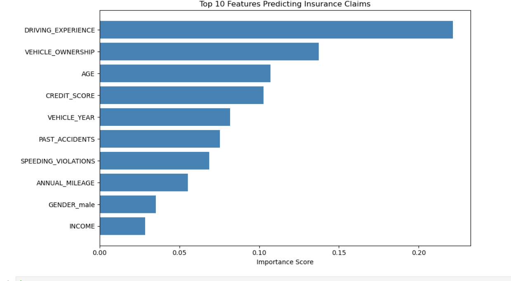

# 🚗 Motor Insurance Risk Scoring Model

A machine learning project I built to predict which car insurance 
customers are likely to make a claim, using Python and Power BI.

---

## Why I built this

I wanted to understand how insurance companies like Admiral use 
data to assess customer risk. So I got a real car insurance dataset, 
built a model from scratch, and created a dashboard to present 
the findings — the same kind of work a pricing analyst would do.

---

## What I did

- Loaded and cleaned a dataset of 10,000 insurance records
- Explored the data to find patterns in claims by age and vehicle type
- Built two models — Logistic Regression and Random Forest
- Used the Random Forest model to score each customer's claim probability
- Grouped customers into Low, Medium, and High risk bands
- Built a Power BI dashboard to show the results clearly

---

## Results

| Metric | Result |
|---|---|
| Customers scored | 2,000 |
| Claim rate | 32% |
| High risk customers | 432 |
| Medium risk customers | 354 |
| Low risk customers | 1,214 |
| Average risk score | 0.31 |

### Claims by Vehicle Type

---

### Feature Importance

---

### Insurance Claims by Age Group

---

### Insurance Claims by Credit Score

---

### Power BI Dashboard

---

## What I found

- Age group 2 has the highest number of claims
- High risk customers score 0.7 or above on average
- Credit score and annual mileage are strong predictors of claim likelihood
- 68% of customers fall into the low risk category

---

## Tools

Python · Pandas · Scikit-learn · Matplotlib · Power BI · Jupyter Notebook

---

## Files in this repo

| File | What it is |
|---|---|
| `insurance_risk_analysis.ipynb` | Full Python notebook |
| `insurance_risk_scored.csv` | Dataset with risk scores added |
| `power bi Dashboard.png` | Power BI dashboard |
| `features.png` | Top features predicting claims |
| `claims_by_age.png` | Claims breakdown by age group |
| `claims_by_vehicle_type.png` | Claims breakdown by type of vehicle |
| `claims_by_credit_score.png` | Claims breakdown by credit_score |

---

Priya Gupta · Data Analyst · Cardiff, UK  
[LinkedIn](https://linkedin.com/in/priya-gupta13)
